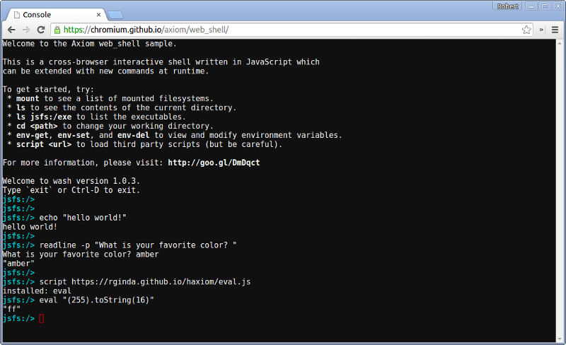

# TODO

The axiom name is taken by a [Yoeman-like workflow tool](https://www.npmjs.com/package/axiom).  We'll need a new name, stat.


# Axiom: Universal File System, Streams, and Processes API for JS

Axiom is a cross browser library that provides primitives for File Systems, Streams, and Processes.

If you're not already familiar with Axiom, please read our [explainer document](doc/explainer.md) for a brief introduction to the project.

## Live demo

[](https://github.com/chromium/axiom/tree/master/samples/web_shell/README.md)

For a live demo of Axiom in action, check out the [web_shell sample app](https://chromium.github.io/axiom/web_shell/) on our github.io page.  Read more about it in [web_shell/README.md](https://github.com/chromium/axiom/tree/master/samples/web_shell/README.md).

## Building Axiom

If you're already familiar with node.js, npm, and grunt, you can jump right in with...

```
$ cd path/to/axiom
$ npm install
$ grunt dist
```

For more detailed information see our [build.md](doc/build.md) document.

## The Axiom distribution

The Axiom distribution includes two libraries, `axiom_base` and `axiom_wash`.

The `axiom-base` library contains the file system library and drivers for a few stock file systems, including:

* An in-memory file system called "jsfs".
* A [DOM File System](http://dev.w3.org/2009/dap/file-system/pub/FileSystem/) based driver called "domfs".  (Supported cross browser using [a polyfill](https://github.com/ebidel/idb.filesystem.js).
* A [Google Drive](https://developers.google.com/drive/v2/reference/) file system.

(The DOM and Google Drive file system drivers may move out to separate packages at some point.)

The `axiom-wash` library contains a command line interface running on top of axiom-base.  It includes the wash command shell and a few supporting executables (cd, cp, mv, etc.).  If your application doesn't need to provide a command line interface you won't need to include this library.

These libraries are available as raw ES6 modules, individual AMD-compatible files, concatenated AMD-compatible bundle, and individual CommonJS modules.  Choose whichever version suits your particular application.

## Importing Axiom

NOTE: We've yet to *finalize* the name for "Axiom".  Once that's done, we'll be publishing npm packages for the axiom-base and axiom-wash libraries.  Until then, you need to build them yourself by following the instructions in our [build.md](doc/build.md) document.

If your application is browser based you'll probably want to load the AMD bundle in a &lt;script&gt; tag.

If your application has an AMD loader already, you may use its `require` function to import axiom modules.  Module access will look like `var FileSystem = require('axiom/fs/base/file_system').FileSystem';`.

If you don't have your own AMD loader you have two options.  You can replace `require` with `__axiomRequire__` as shown above, or you can export the modules to a global variable.  To create a global variable, call `__axiomExport__(window);` before calling any Axiom code.  This will create a `window.axiom` object containing the Axiom modules.  You can access modules with code like `var FileSystem = axiom.fs.base.file_system.FileSystem`.

If you're using Axiom in a node.js environment, make sure to include the cjs/ directory from the Axiom distribution in your module path, and require modules with code like `var FileSystem = require('axiom/fs/base/file_system').FileSystem;`.

## Axiom API

Documentation is a work-in progress.  Stay tuned to our [api.md](doc/api.md) document.  Until that's done, start with the [web_shell sample](samples/web_shell/) or the [base file system](lib/axiom/fs/base) classes.
